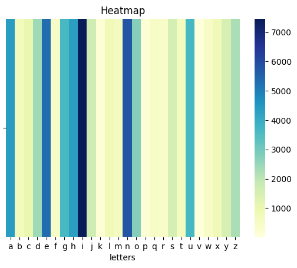
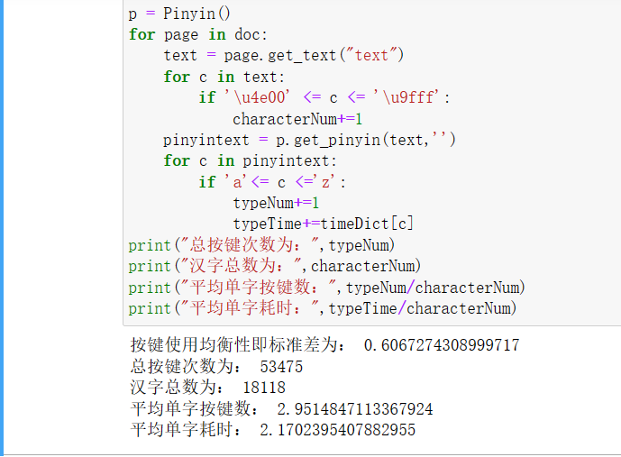
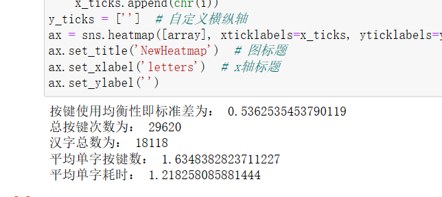
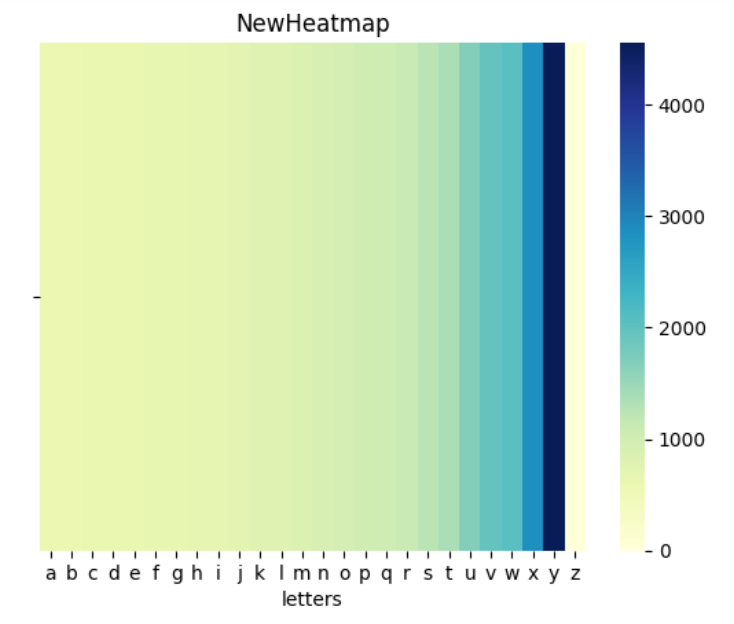
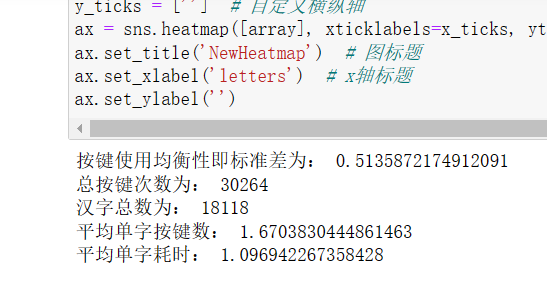
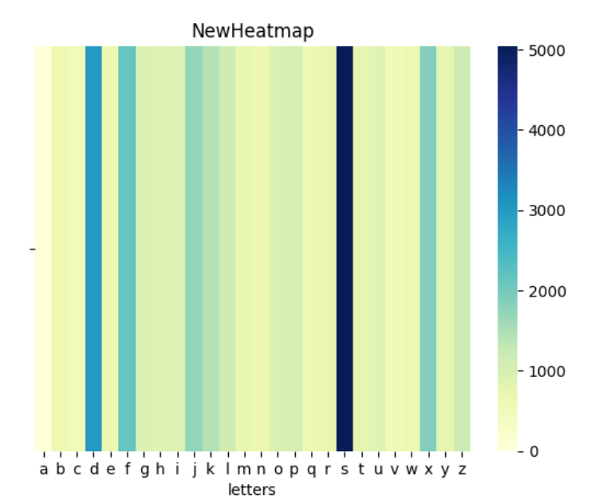
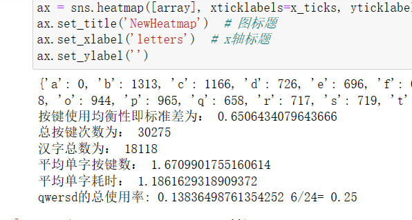
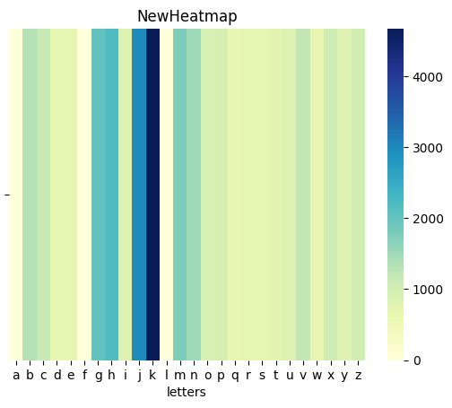

# 题目要求
**题目：高效均匀的打字编码方法**

由于不同汉字的使用频率和输入方式不同，使用全拼输入法撰写文章时，26个字母键盘的使用频率并不均衡。 
假设给定一篇中文文章素材（附件文章），使用全拼输入法（不考虑词组缩写）输入这篇文章中的文字。 
请你并按照要求评价全拼输入法，并对其进行改造。 
 
具体要求：

1.给定一篇中文文章（附件中的文章），统计出使用全拼输入法录入这篇文章时26个字母键的使用频率，绘制热力图。 
输入: 一篇中文文章（附件文章） 
输出: 录入这篇文章的26字母键使用热力图 

2.设计评价标准来分别评价使用全拼录入这篇文章时的按键使用均衡性和输入效率（请根据个人理解自行定义，建议使用明确的量化指标）。   
输出: 量化评价标准或方法，以及对全拼输入方案的评价结果 

3.基于你在题目2中制定的标准，尝试在全拼基础上改进打字编码方案，使得输入该文章时字母键的使用更加均衡、输入更加高效，展示、分析改进的结果，并通过数据评价对用户输入习惯的影响。 
输入: 一篇中文文章（附件文章） 
输出: 新的打字编码方案、新旧方案在均衡性和输入效率方面的对比、新方案对用户使用习惯的影响 

4.某用户的键盘中，按键A和F已经坏了，按键QWERSD的使用寿命较其他按键要短30%。请进一步改进步骤3中的方案，保证正确输入的前提下，达到较好的均衡性和输入效率。 
输入: 同上一问 
输出: 新的打字编码方案、新旧方案在均衡性和输入效率方面的对比、分析AF与QWERSD带来的额外代价 
#  实现环境
任务需要完成pdf的读取、频率的统计、评价指标的计算和图像的绘制，使用python和相关库易于实现。

# 题目1
## 1.读取pdf中的汉字
使用PyMuPDF库实现对pdf的读取，该工具可以方便地从pdf中提取汉字或图片。
## 2.将汉字转化为拼音
使用xpinyin库，该工具可以将汉字字符串转换为拼音字符串并可以自定分隔符。
## 3.绘制26字母使用热力图
使用seaborn库，可以输入数组和相关参数后输出热力图。

# 题目2
## 1.评价按键使用均衡性
考虑使用按键使用次数的标准差来评价按键使用均衡性，因为一般情况下的打字手势手指放在键盘中间的七个按键上，相对其他字母而言点击这七个字母应该更加快速，所以把按键次数分为两组分别计算标准差然后相加作为均衡性的参考指标，在计算标准差之前要分别对数据进行01规范化以消除量纲的影响，这样的评价标准既考虑到了数据的波动性，又对打字的速度和键盘布局有一定反映。
## 2.输入效率
打字时敲击键盘的次数与拼音的字母数量相关，所以用平均单字按键数和平均单字耗时反映输入效率，计算输入时间时取中间七个字母0.5秒，其他字母0.8秒来反映不同位置按键的点击时间差异。

**平均单字按键数=按键次数总数/文章汉字数**
**平均单字耗时=总按键耗时/文章汉字数**

# 题目3
## 1.使用哈夫曼编码来减少编码长度
为了使输入更加高效，首先考虑减小平均单字按键数，也就是平均编码长度，哈夫曼树可以使带权路径长度最短，符合减少平均编码长度的需要。全拼输入法是一个字母组合即读音对一簇汉字的对应关系，不对所有汉字一一编码，所以重新对每个读音进行编码即可完成一个可用的改进，这里把每个读音作为结点，读音出现的次数作为权值，构建一个26元的哈夫曼树，再遍历编码树得到新的编码字典[codeDict.json](./codeDict.json)，这样得到的编码规则可以实现给定文件的最短字母编码，计算的评价标准如下：

可以发现平均单字按键数和平均单字耗时得到了显著的提升，按键使用均衡性也有少量提升，按键的使用情况如下：

可以发现按键的使用集中在右边，也就是权重大的结点集中在树的右方，分析得出这是因为在构造哈夫曼树时每次都从队列中从小到大取结点，所以大的结点更容易落在右边，而大权重的结点又可能有大的子节点，最终造成了结点落在编码树的右边。
## 2.改进编码树的构建规则从而增加按键使用均衡性
为了让按键使用更加均衡，考虑让编码树更加平衡，并让叶子节点均匀地落在根结点的各个子节点。在构建编码树时，生成的新结点进入队列时不再立刻排序，让叶子结点更均匀地分布；此外，考虑到不同按键的点击速度不同，而且编码集中在树的右方，所以改变从编码树得到编码的规则，让点击更快的字母对应到树的右侧，从而让这些字母更多地被使用，改进后得到编码字典[balancedCodeDict.json](./balancedCodeDict.json)，改进后的输出结果如下：

可以发现较改进前有更低的标准差，即更高的均衡性，因为破坏的哈夫曼树的构建规则，所以平均单字编码数有所上升，但是因为改变了编码的规则，平均单字耗时有了较明显的降低。
# 题目4
因为按键a、f损坏，所以在构建编码树时使用二十四度的编码树，按键qwersd的寿命要短于其他按键，所以尽量减少使用，在从编码树获取编码规则时把这些字母放在树的左侧，获得新的编码字典[improvedCodeDict.json](./improvedCodeDict.json)，改进后的输出结果如下：

因为定义的标准差计算规则分了两个维度进行计算，a和f不能使用，s和d要减少使用，而为了平均单字耗时第二行的j、k、l又要多使用，所以标准差上升较为明显，平均单字按键数和平均单字耗时没有太大的变化，这样的编码下按键qwersd的使用率很低，跟平均使用率比大概降低了一半。
# 思考
如果要关注提高按键使用的均衡性，可以考虑使用其他的编码树构建方式，让编码树趋于平衡，叶子结点分布均匀，可以考虑构建平衡树；如果要提高编码的易用性，可以添加声母和韵母的区分，并让编码树在第一层和后面的层产生不同的分支规则。由于时间紧张，本解答注重平均编码长度的优化，这里无法给出所有方案的具体实现。